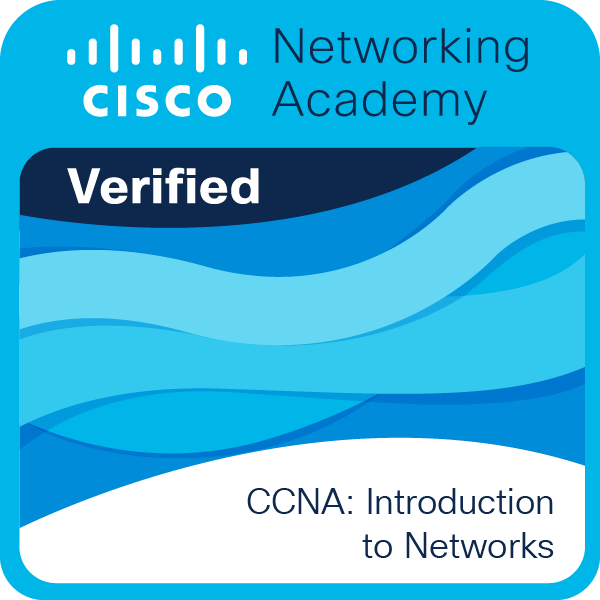

<h1 align="center">Hi 👋, I'm Bloatificoast</h1> <h3 align="center">Cybersecurity student, red-teamer in training, and full-time tech enthusiast</h3>
💫 About Me
🔭 I'm currently working on growing my skills as a cybersecurity student
🤝 I'm looking for help with cybersecurity and programming
🌱 I'm currently learning Cybersecurity, Python, C++, Assembly, and PHP
💬 Ask me about cybersecurity, programming, and red-teaming
⚡ Fun fact: I love technology
 
🎓 Certifications

  

Cisco Networking Academy — CCNA: Introduction to Networks ✅ Verified

Successfully completed a course covering switch/end-device configuration, Ethernet physical & data link layer operation, router configuration for end-to-end connectivity, IPv4/IPv6 addressing schemes, upper-layer OSI protocols, small-network security best practices, and network troubleshooting.

📄 View certificate — click the badge above or the link for proof.

 
🌐 Socials

      
  
💻 Tech Stack

          
  
📊 GitHub Stats

      

🏆 GitHub Trophies

  

✍️ Random Dev Quote

  

🔝 Top Contributed Repo

  

  

💰 Support Me

  
 <!-- Proudly created with GPRM ( https://gprm.itsvg.in ) -->
